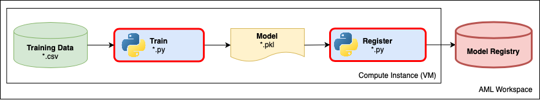

## Lab 12:  Refactor the Model to use AMLS for training

Now you can successfully reproduce the safe driver prediction model using the notebook. The team would like to continue to ensure quality and improve the model code as well as centrally share models and results with others during development.  All of these goals are challenging with the training code embedded in a notebook and no centralized services are being utilized to facilitate sharing.  

What can be done to help the team with these goals?  
* Extracting the notebook code into Python scripts is an important step to ensure code quality via *lint* and unit tests and also clean execution on remote compute targets.  
* Logging parameter values and model validation metrics centrally with the Azure Machine Learning service makes it easy to compare the performance of different versions of the model and the parameters they were trained with.

In this experimentation phase your data scientists will want to execute many experiments with hyper-tuned parameters or configurations, so execution against 'remote' compute can save the team time in finding the best model while easily sharing results.

### Discussion topics before we start this section  

1. When is the right time to refactor Jupyter notebooks into python files?  Are there any alternatives to doing this?  
1. What is the benefit of running your experiments using Azure Machine Learning?
1. What are the benefits of using a model repository and tracking the metrics and other parameters?

### Steps
1. Navigate to [Lab12/safe-driver-prediction-v2.ipynb](./safe-driver-prediction-v2.ipynb). 
    * this is basically the previous notebook but we are going to take some additional steps to refactor the code to work better with AMLS
    * upload this file to your JupyterLab environment.  

We are going to build something like this:

* we want to refactor the Jupyter code into a `train.py` file
* it will generate a model .pkl file based on the training data
* we will register that model into the AMLS model registry

## Helpful Hints

* To open a terminal (command prompt) in Jupyter, click the "New" button on the notebook dashboard and select "Terminal".
* To connect to your workspace from the Jupyter environment, the best practice when using the Azure ML SDK is to use the `Workspace.from_config()` method to read the connection information from a workspace configuration file. On compute instances in your workspace, this file is created automatically. When using your own development environment, you must create this file in the same folder as your code. See [Configure a development environment for Azure Machine Learning](https://docs.microsoft.com/azure/machine-learning/how-to-configure-environment#workspace) for details.
## Resources

* [Documentation - How to monitor Azure ML experiment runs and metrics](https://docs.microsoft.com/azure/machine-learning/how-to-track-experiments)
* [Documentation - Train scikit-learn models at scale with Azure Machine Learning](https://docs.microsoft.com/azure/machine-learning/how-to-train-scikit-learn)