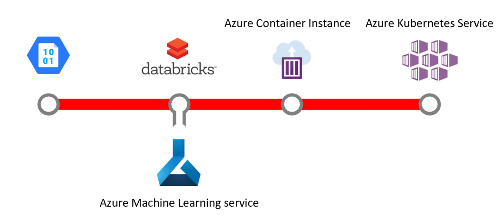

## Lab 2:  Azure Machine Learning Services

We are going to begin doing some rudimentary data science.  For this workshop we'll use combinations of Azure services to create an end-to-end solution.  Here's the architecture we are shooting for:

.  

In this lab we are going to deploy and learn a little bit about what Azure Machine Learning Services (AMLS) is, what problems it solves, etc.  This is probably the shortest and simplest lab.  

[What is MLOps and How Does AMLS Help - Presentation](AMLS.pptx) 

### Discussion topics before we start this section  

1. What is AMLS?  Why use it?  
2. Alternatives?
3. Why do we introduce this now and not AFTER we throw our models over the wall to the data engineer/DevOps/SRE Engineer?  

### Deploy AMLS

1. Create an Azure Machine Learning service workspace in the Resource Group created earlier using the Azure Portal
1. Follow all prompts and deploy the service.  
1. You will need to make note of the following AMLS values from the Overview page after deployment:  

Name | Value |  Example Value|
------|------------------|--------|
Subscription ID| | 52061d21-01dd-4f9e-aca9-60fff4d67ee2|
Resource Group| | MLOpsWorkshop|
Location||East US|

**We will need these values later**

