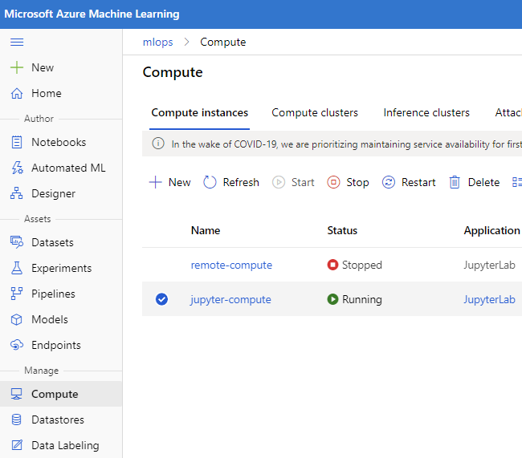
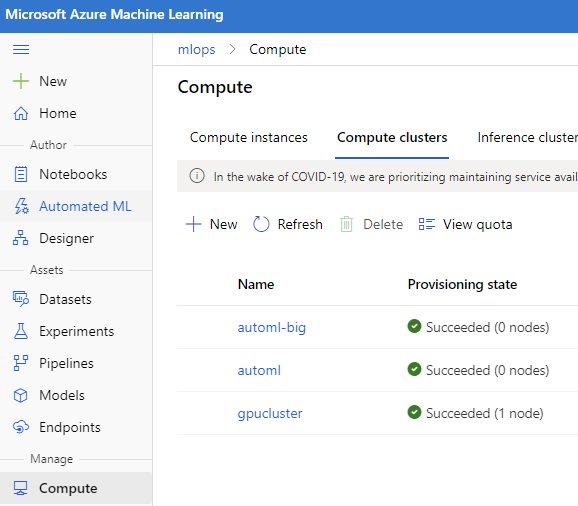
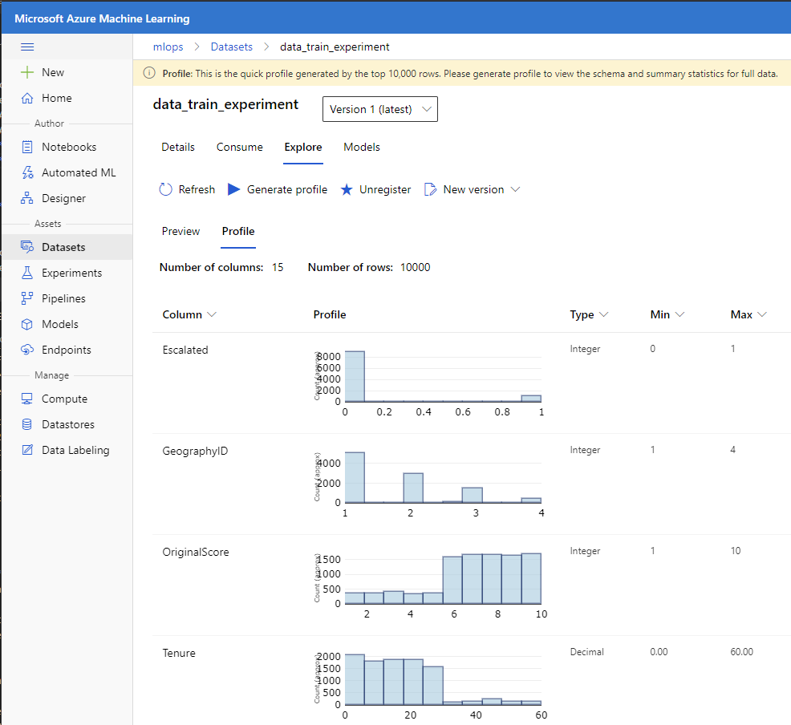
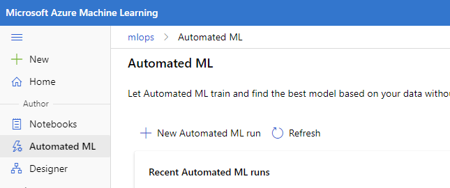
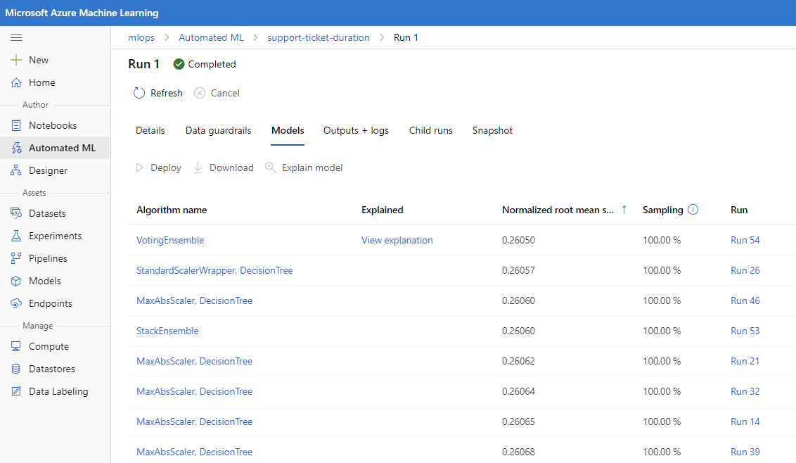

## A Day in the Life of a Data Scientist  - The Data Science Process

You are somewhat new to data science and your boss hands you a new dataset and says, "make something out of this."  Where do you even start?  In this lab we do exactly that.  In this lab we are given a dataset of support tickets and we are told, "unlock some insights to help the support team become more efficient and provide better service to customers."  We work through how to get started on an analytics problem like this.  
    * What do we do?
      * use standard data science techniques to explore the data
      * determine deductively what are some interesting problems we can solve
      * use automl to see if we can quickly predict those problems
      * deploy the best model, assuming it meets our goals
      * present your interesting analytics to executive leadership
    * How we do it?:
      * AMLS
      * Jupyter/python/pandas/visualizations
      * automl
      * deploy an automl "no-code" container
      * consume the model's REST API 
      * Power BI for the final data presentation

## Getting Your Environment Ready

* Power BI desktop
* Azure Subscription
* AMLS service
  * Choose to Upgrade the workspace to the **Enterprise edition (Preview)** [see more information on current pricing here](https://azure.microsoft.com/en-us/pricing/details/machine-learning/) - you will need enterprise edition to complete the experiment section.
* In AMLS launch your Compute instance and JupyterLab.  To create one:
    * Select 'Compute' from left pane
    * Select 'New' under 'Compute Instances'
    * Provide a 'Compute VM Name' (all lowercase)
    * Keep the default size VM provided

* select the `JupyterLab` Link
    * Enter the user folder by double clicking
    * Select the upload button and upload the files listed below in the folders listed below -- or -- clone this repo into the JupyterLab VM using the `Terminal`:
        * [data/data_train.csv](data/data_train.csv)
        * [code/explore.ipynb](code/explore.ipynb)
        * [code/deploy.ipynb](code/deploy.ipynb)
        * [code/config.json](code/config.json)
* Create a **Compute Cluster** or use your existing one.  We will use this for automl training later
    * Select 'Compute' from left pane
    * Select 'New' under the 'Training Clusters' tab
    * Provide a 'Compute Name' (all lowercase)
    * Choose a VM size
        * For standard compute select something like 'Standard_DS2_v2'
        * For GPU compute select 'Standard_NC6'
    * Select 'Low Priority' for Virtual machine priority
    * Minimum number of nodes set to 0 (then it will scale down completely and reduce costs)
    * Set maximum nodes from 3-6
    * Click 'Create'

* Upload the **Dataset** (we could also do this from code, but we do it from the UI to take a first look at the data)
    * Select 'Datasets' from left pane
    * Select 'Create dataset' and then 'from local files'
    * Select the 'Browse' button and find the `data_train_experiment.csv` file
    * Select 'Next'
    * Review the data and select 'Next' and 'Next' again.  **Watch the headers**
    * Finally review the dataset settings and select 'Create'
    * If you choose to Profile you should see some interesting summary statistics 

## Data Exploration/Sandboxing

We want to examine the data

In JupyterLab:

* Open [**Explore.ipynb**](code/explore.ipynb)
* Run through all code cells using <kbd>Ctrl</kbd> + <kbd>Enter</kbd>

We think we can probably predict the number of days a ticket will take until final disposition.  But we aren't sure.  Let's see if we can predict that next using automl

## Creating an ML algorithm

* Launch your AMLS workspace
* Select **Automated ML** on the left pane

* Click **'New automated ML run'**
* Select the training data dataset (data_train_experiment-XXXXXX)
* Provide an experiment name
* Select **Duration** for Target column
* Select the 'Training Cluster' of compute you setup above
* Select **Regression** for Prediction Task
* Select **'View additional configuration settings'** and set Primary metric to **'normalized_root_mean_squared_error'**
* Set Concurrency, Max concurrent iterations to 3
* Set Exit criterion, Training job time (hours) to .5
* Select **'Save'**
* Select **Finish**

Monitor the automl run from the portal.  Again, all of this we could've done from code.  This will take about a half hour.  **Don't close the run after you are done, we will jump right into deploying the model next.**  Get familiar with what the interface is trying to tell you.  

## Deploying the Best Model

After your run completes you'll probably see something like this:

The models are ordered by best RMSE (assuming you chose that metric).  The voting ensemble will always be the best b/c it is a conglomeration of everything.  But deploying it will likely be slow.  Perhaps it is best to just deploy the next best model???

* Click the model you want and chose `Deploy`
* Create a deployment name, example: `support-ticket-duration`
* Add a deployment description if you wish
* Compute Type set to ACI (Azure Container Instance) unless you have an AKS inferencing cluster already running.  
* authentication disabled
* Choose **Deploy** button

>This will take a while to run - ~10 mins.  You can monitor this under `Endpoints`

* Once complete select **Endpoints** on the left pane
* copy the REST API endpoint, we are going to test it next
* Open [**Deploy.ipynb**](code/deploy.ipynb) in your JupyterLab
* Run each cell of the notebook

## Present the data with Power BI

* Open Power BI Desktop with `Present.pbix`
* Interact with the data and visuals

**Can you determine how to publish this report to Power BI Online?  Then, can you make predictions based on your new web service against the data?  Can you then create a visual to display that data for an executive dashboard?**