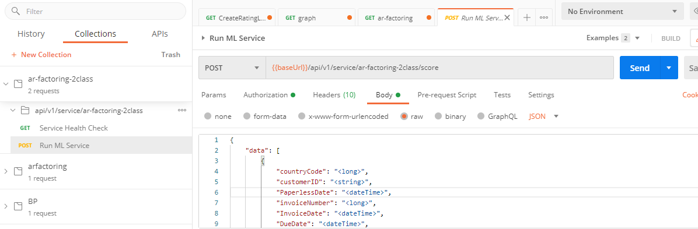

## Accounts Receivable Prediction Using automl

[Background](https://www.kaggle.com/ahammedjaleel/account-receivable-prediction)

We are going to use a copy of this dataset and simplify it to just do binary classification -- will the payment be late or not.  

The modified dataset is available [here](./WA_Fn-UseC_-Accounts-Receivable.csv).  All we've done is add a `LatePayment` binary column to the end of the dataset.  

We will use Postman to test the API.  You can download Postman now.  

We will use the UI for most of this lab to get you familiar with automl capabilities.  All of this can be done in code however.  [Here is a slightly different example that you can modify](https://github.com/Azure/MachineLearningNotebooks/blob/master/how-to-use-azureml/automated-machine-learning/local-run-classification-credit-card-fraud/auto-ml-classification-credit-card-fraud-local.ipynb) that demonstrates how to do all of these steps from a Jupyter notebook programmatically.  

## automl steps

1. Upload the file as a `dataset` using your AMLS workspace.  Make sure you choose all of the correct settings when you upload the file.  The most important is the header rows.
1. Create a new `Automated ML` run in your AMLS workspace.  
  * Choose your new dataset
  * Choose Create New Experiment
  * Target Column is `LatePayment`
  * Choose a Compute Cluster or create it
  * This is a Classification task type
  * **Make sure you change the `View add'l configuration settings`**
    * primary metric:  accuracy
    * in the interest of time you can block quite a few of the algorithms.  
    * Make sure you leave at least `Logistic Regression`
    * Exit Criterion = training job time of .25 hours (this means training will run for about 15 mins)
  * Start the automl run

Monitor the run using the AMLS UI.  When it's done, check the following:  
* Data guardrails.  Any interesting issues?
* What was the best model?  Why are ensemble models always the best?
* Create a model explainability run for one of the non-ensemble models

## Deploy the model

We can now deploy one of the models to either AKS (if you have one running) or ACI (if you don't have AKS cluster running this will be much faster).  You should not need to change any other options.  This is a "no-code deployment" since it is so simple.  

You can monitor the deployment under `Endpoints` in AMLS 

We can now test the deployment using Postman.  
* Open Postman and build a new collection.  
* Choose Import and import the swagger link from the deployment endpoint page.



You can test with this data in the Body:

```json
{
    "data": [
        {
            "countryCode": "391",
            "customerID": "0379-NEVHP",
            "PaperlessDate": "4/6/2013",
            "invoiceNumber": "611365",
            "InvoiceDate": "1/2/2013",
            "DueDate": "2/1/2013",
            "InvoiceAmount": "55.94",
            "Disputed": "No",
            "SettledDate": "1/15/2013",
            "PaperlessBill": "Paper",
            "DaysToSettle": "13",
            "DaysLate": "5"
        }
    ]
}
```

Now that you have a working model, let's look at `continuous retraining` (a type of MLOps) using AMLS Pipelines.  We will build these programmatically using a Jupyter notebook as a guide.  Open JupyterLab using your Jupyter compute instance in AMLS (if you don't have one, build a small one now).  

Now open [amls-automl-continuous-retraining.ipynb](amls-automl-continuous-retraining.ipynb).

Execute each of the cells, changing any parameters as needed.  