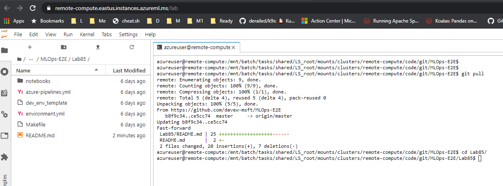
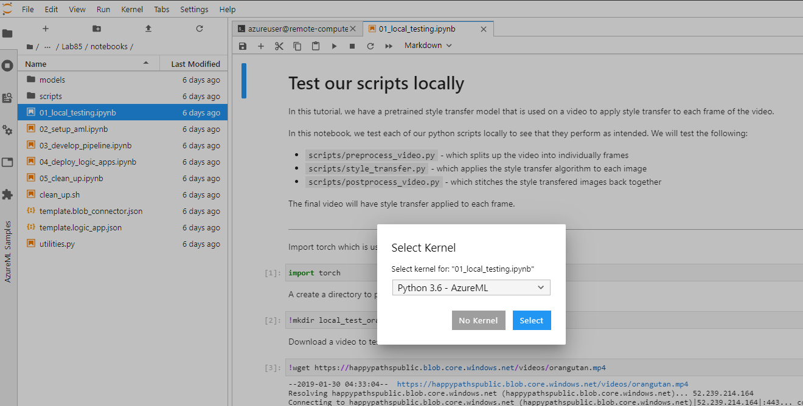

# Batch Scoring Deep Learning Models With Azure Machine Learning

## Overview

We want to apply `style transfer` onto a video (a video is really just a collection of images). I doubt any business would want to do this in the real world but this architecture can be generalized for any **batch scoring with deep learning scenario**. 

An alternative solution using Azure Kubernetes Service can be found [here](https://github.com/Azure/Batch-Scoring-Deep-Learning-Models-With-AKS).

## Architecture 


The above architecture works as follows:
1. Upload a video file to storage.
2. The video file will trigger Logic App to send a request to the AML pipeline published endpoint.
3. The pipeline will then process the video, apply style transfer with MPI, and postprocess the video.
4. The output will be saved back to blob storage once the pipeline is completed.

### What is Neural Style Transfer 

| Style image: | Input/content video: | Output video: | 
|--------|--------|---------|
|  | [](https://happypathspublic.blob.core.windows.net/assets/batch_scoring_for_dl/input_video.mp4 "Input Video") *click to view video* | [](https://happypathspublic.blob.core.windows.net/assets/batch_scoring_for_dl/output_video.mp4 "Output Video") *click to view* |


## Setup

You can run this locally on your laptop but then you'll likely need to install a bunch of dependencies like conda, az cli, etc.  

A better solution is to use JupyterLab from your AML compute instance. 

1. Open JupyterLab, then open a terminal




```bash

## clone this repo on the remote compute, if needed
## git clone https://github.com/davew-msft/MLOps-E2E
cd Lab85

## login to Azure
az login

## this will create a conda environment called __batchscoringdl_aml__
echo ". /anaconda/etc/profile.d/conda.sh" >> ~/.bashrc
echo "conda activate" >> ~/.bashrc
conda activate
conda env create -f environment.yml
conda activate batchscoringdl_aml


```


## Steps
Run through the following notebooks, opening each one in JupyterLab:
1. [Test the scripts](notebooks/01_local_testing.ipynb)

The notebook should look something like this:  




2. [Setup AML](notebooks/02_setup_aml.ipynb).
3. [Develop & publish AML pipeline](notebooks/03_develop_pipeline.ipynb)
4. [Deploy Logic Apps](notebooks/04_deploy_logic_apps.ipynb)
5. [Clean up](notebooks/05_clean_up.ipynb)

## Clean up
To clean up your working directory, you can run the `clean_up.sh` script that comes with this repo. This will remove all temporary directories that were generated as well as any configuration (such as Dockerfiles) that were created during the tutorials. This script will _not_ remove the `.env` file. 

To clean up your Azure resources, you can simply delete the resource group that all your resources were deployed into. This can be done in the `az group delete --name <name-of-your-resource-group>`. 

All the step above are covered in the final [notebook](notebooks/05_clean_up.ipynb).

