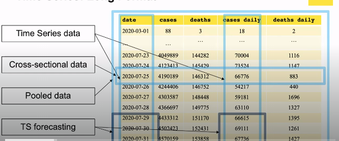
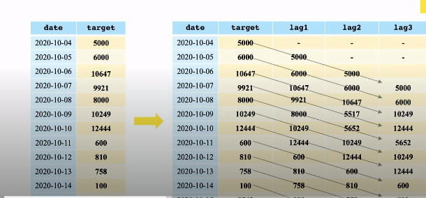
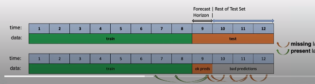

## What is Time Series Analysis

* a statistical technique that deals with temporal data, to extract meaningful information from the data
* time-series data:  a sequence of observations taken sequentially in time, generally taken at specific time intervals (60 seconds, 5 mins, etc). 
* time series forecasting:  a model to predict future alues based on previously observed values
* cross-sectional data:  data of other variables that are collected near the same period of time as the time series data that can enrich the data's meaning
* pooled data:  a combination of time series data and cross-sectional data.  

Example using covid data:

### Lagging Features 

This is a common feature engineering approach to TS data:

one column will create many features as "lags".  

### Rolling Predictions

* model performance degrade squickly for various reasons, but usually mostly because the engineered features aren't available the further out the forecast horizon you are.  
* don't set the forecast horizon longer than necessary and use the next two techniques to help you.  

* one solution is to augment the test data using TTA (Test Time Augmentation) where we add data so the predictions are better.  
  * fast and works well when a model is released to production
  * all we are really doing is pre-computing the lags and data so model degradation will get worse
* another solution:  Extend Train and Refit.  We slide the prediction window step by step over the whole test period and keep retraining our model.  