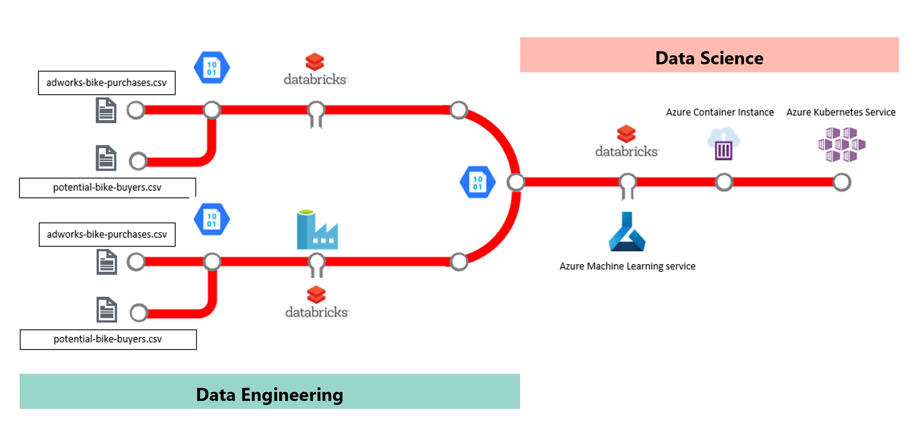

# MLOps End to End Workshop

## What Technologies are Covered

* Databricks (dbx)
* Azure Machine Learning Service (AMLS)
* Azure Container Instances (ACI)
* Azure Kubernetes Service (AKS)
* Azure DevOps (AzDO)
* Jupyter Notebooks ([notebooks.azure.com](https://notebooks.azure.com))

## Target audience

-   Data Scientists
-   App Developers
-   AI Engineers
-   DevOps Engineers 
-   Anyone wanting to learn to think like a Data Scientist and take their analytics to the next level

The solution will look something like this:  

## Business Case Background

Our company sells bikes.  We have data about who does and does not buy bikes.  We'd like to use that data to build a predictive model to determine who will buy bikes in the future.  

TODO

## Workshop Objectives

In this workshop, you will learn how to:

* use the az cli to deploy resources to Azure
* setup and configure Azure Databricks for analytics
* setup and configure Azure ML Services to integrate your data science work into your DevOps pipelines.  

## Workshop Agenda

1. [Lab 1:  Setup the resources needed for this workshop](Lab1/README.md)
1. [Lab 2:  Learn about Azure Machine Learning Services](Lab2/README.md)
1. [Lab 2a: Getting Databricks Ready for DevOps/MLOps](Lab2a/README.md)
1. [Lab 3:  Build and Deploy an ML Model](Lab3/README.md)  

Alternate Labs:  

1. Load data to ADLS2 with ADF and Databricks

1. **Remove the RG you created to prevent incurring Azure costs**

TODO:  move notebooks to DBXNotebooks
sync azdo to gh, etc